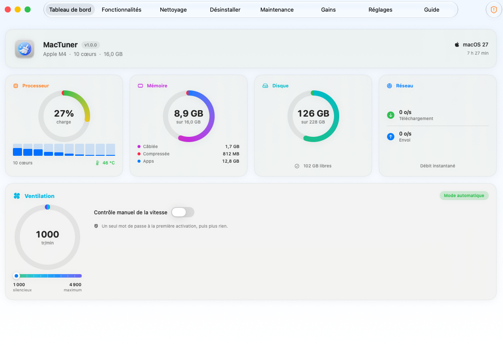

# MacTuner 1.0.1

Transparence sur SIP, interface unifiée et corrections du ventilateur. 100 % natif SwiftUI, libre et open source (MIT).



## Nouveautés de la 1.0.1

- 🔒 **Transparence SIP** : l'onglet **Fonctionnalités** classe désormais chaque réglage en deux catégories nettes — **Effet immédiat (compatibles SIP)** et **Nécessite SIP désactivé**. Avec System Integrity Protection activé, macOS refuse d'arrêter les agents Apple (Siri, Apple Intelligence, télémétrie…) ; ces réglages sont **grisés et non modifiables**, et MacTuner n'affiche **aucun gain fictif**.
- 🎨 **Interface unifiée** : thème sombre assaini (fini le gris-marron des matériaux translucides), accents ambre, boutons homogènes, et **tous les onglets** alignés sur le même gabarit (en-tête, largeur, cartes, grille) que Fonctionnalités.
- 🌀 **Ventilateur fiabilisé** : le retour au mode automatique relâche réellement le SMC et retire l'override de démarrage ; le bouton **Valider** ne peut plus échouer en silence.
- ♻️ **« Paramètres par défaut »** remet l'app exactement comme au premier lancement (réactive tout, ventilateur en auto, préférences effacées, relance).

## Ce que fait MacTuner

- 📊 **Tableau de bord** temps réel : CPU par cœur, mémoire, disque, réseau, température, batterie et ventilation.
- 🌀 **Ventilation** : contrôle manuel borné au min/max constructeur, presets, réapplication au démarrage.
- ⚙️ **34 réglages système** désactivables et 100 % réversibles (Siri, Apple Intelligence, télémétrie, iCloud…).
- 🧹 **Nettoyage** sur 18 catégories de fichiers régénérables.
- 🗑️ **Désinstallation** sans résidu (apps, outils CLI, fichiers cachés).
- 🔧 **Maintenance** système et 📈 mesure des **gains** réels (RAM, CPU, disque).
- 🛡️ **Garde-fou central** : la suppression de fichiers critiques est impossible par construction. Aucun fichier système n'est modifié.

## Installation

1. Téléchargez **`MacTuner-1.0.1.zip`** ci-dessous.
2. Décompressez, puis glissez **MacTuner.app** dans **Applications**.
3. Premier lancement : **clic droit → Ouvrir** (app signée ad-hoc, non notarisée).

Si Gatekeeper bloque :
```bash
xattr -dr com.apple.quarantine /Applications/MacTuner.app
```

## Compatibilité

**macOS 26 et 27** · Mac **Apple Silicon** (M1 à M4) uniquement.

## Vérification de l'archive

```
SHA-256  f7e7bd02065b511180102ed351b4ef2398d1bd884e37448cd9c157ed9b917559  MacTuner-1.0.1.zip
```

---

Historique complet : [`CHANGELOG.md`](CHANGELOG.md) · Créé par **Rodolphe Vandaele**
